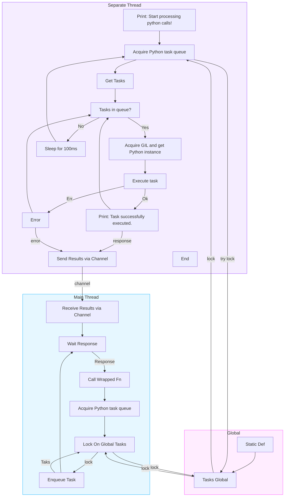

Based on the provided information, here's a refactored README for your Python processing pool project:

---

# RustPyNet: Python Operations Processing Pool in Rust

RustPyNet is designed to bridge the gap between Python and Rust, offering a Python operations processing pool that integrates seamlessly with the PyO3 crate.

## Objective

The primary goal of RustPyNet is to address the limitations posed by Python's Global Interpreter Lock (GIL). By facilitating multi-threaded operations, RustPyNet allows for parallel execution of Python functions, even though it's bound to a single interpreter. This makes it particularly suitable for scenarios where the bulk of the workload is handled by Rust, but there's a need to execute smaller tasks in Python.

Key Features:
- **Bypass GIL Mechanism**: Enables parallel execution of Python code sections that would otherwise be limited by the GIL.
- **Thread-Safe Python Object Transfer**: Facilitates the transfer of Python objects between threads.
- **Procedural Macros**: Simplifies the integration of Python into Rust code with procedural macros that auto-index to the Python pool.
- **Efficient for Medium-Small Tasks**: Optimized for tasks that have a light Python workload but are heavy on the Rust side.

## Usage

To get started with RustPyNet, you'll first need to import the necessary modules:

```rust
use RustPyNet::python_pool::pool::{start_processing_host_python_tasks, PythonTaskResult};
use RustPyNet::run_with_py;
use RustPyNet::python_pool::pool::PythonTaskError;
use RustPyNet::python_pool::pool::PythonTaskQueue;
use RustPyNet::python_pool::pool::TaskQueue;
```

Here's a basic multithreading example that demonstrates how to use RustPyNet:

```rust
#[run_with_py]
fn compute_sum(
    dict: &HashMap<String, pyo3::types::PyAny>,
) -> Result<PythonTaskResult, PythonTaskError> {
    // Sample Python code: compute the sum of 1 + 2
    let sum: i32 = py.eval("1 + 2", None, None)?.extract()?;
    Ok(PythonTaskResult::Int(sum))
}

fn main() {
    // Initialize the Python interpreter
    pyo3::prepare_freethreaded_python();

    // Start processing tasks in a separate thread
    std::thread::spawn(move || {
        start_processing_host_python_tasks();
    });

    std::thread::sleep(std::time::Duration::from_secs(2)); // Whait pool initialize!

    const NUM_TESTS: usize = 10;
    let (tx, rx) = std::sync::mpsc::channel();

    let handles: Vec<_> = (0..NUM_TESTS)
        .map(|_| {
            let tx = tx.clone();
            let sample_dict = HashMap::new();

            std::thread::spawn(move || {
                let result = compute_sum(&sample_dict);
                tx.send(result).unwrap();
            })
        })
        .collect();

    let mut correct_responses = 0;

    for _ in 0..NUM_TESTS {
        let result = rx.recv().unwrap();
        match result {
            Ok(PythonTaskResult::Int(value)) => {
                println!("The int is: {}", value);
                if value == 3 {
                    correct_responses += 1;
                }
            }
            Ok(PythonTaskResult::Float(value)) => {
                println!("The float is: {}", value);
            }
            Ok(PythonTaskResult::Str(value)) => {
                println!("The string is: {}", value);
            }
            Ok(PythonTaskResult::Map(value)) => {
                println!("The map is: {:?}", value);
            }
            Ok(PythonTaskResult::List(value)) => {
                println!("The list is: {:?}", value);
            }
            Ok(PythonTaskResult::Bool(value)) => {
                println!("The bool is: {}", value);
            }
            Ok(PythonTaskResult::Error(value)) => {
                println!("The Error is: {}", value);
            }
            Ok(PythonTaskResult::None) => {
                println!("None");
            }

            Err(PythonTaskError::PythonError(err)) => println!("Python error: {}", err),

            Err(PythonTaskError::UnsupportedNumberType) => {
                println!("Error: Unsupported number type")
            }

            Err(PythonTaskError::UnsupportedValueType) => println!("Error: Unsupported value type"),

            Err(PythonTaskError::OtherError(err)) => println!("Other error: {}", err),
            // ... handle other variants of PythonTaskResult and error variants ...
        }
    }

    for handle in handles {
        handle.join().unwrap();
    }

    if correct_responses == NUM_TESTS {
        println!("All responses are correct!");
    } else {
        println!(
            "{} out of {} responses are correct",
            correct_responses, NUM_TESTS
        );
    }
}

```

In the above example, the `compute_sum` function is decorated with the `#[run_with_py]` attribute, allowing it to execute Python code within a Rust function. The function calculates the sum of two numbers using Python and returns the result.

For a more comprehensive example, including error handling and multi-threading, refer to the provided code snippet.



---
