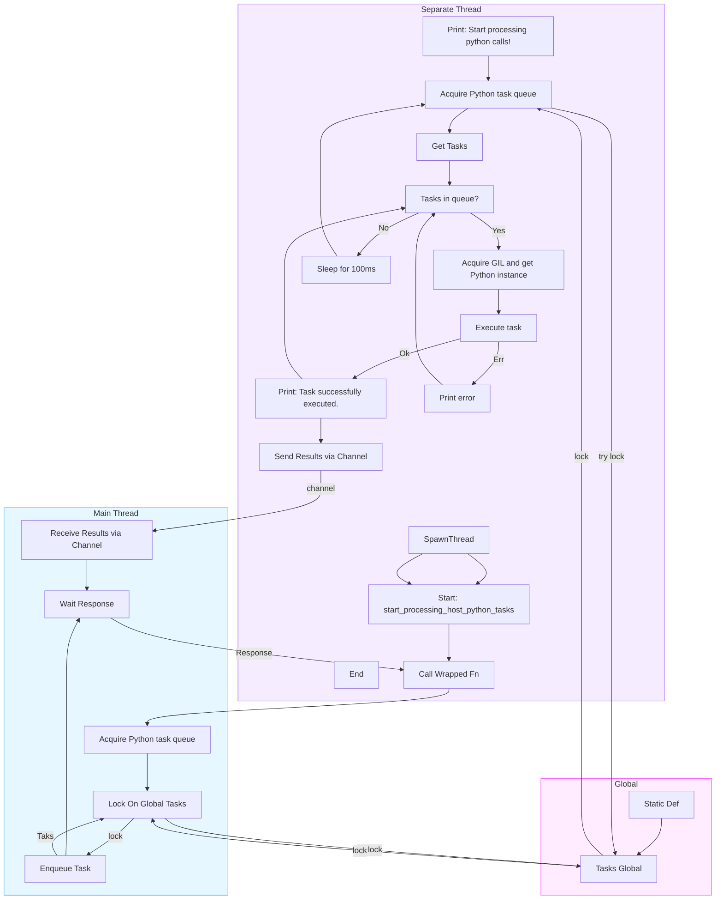

```mermaid
graph TD

    C[Print: Start processing python calls!]
    D[Send Results via Channel]

    subgraph Global[Global]
        style Global stroke:#FF4FFF, fill:#FF4FFF,fill-opacity:0.1
        A[Static Def]
        B[Tasks Global]
        A --> B
    end

    U[SpawnThread] --> N

    subgraph SeparateThread[Separate Thread]
        style SeparateThread stroke:#a14FFF, fill:#a14FFF ,fill-opacity:0.1
        N[Start: start_processing_host_python_tasks]
        E[Acquire Python task queue]
        F[Get Tasks]
        G[Tasks in queue?]
        H[Acquire GIL and get Python instance]
        I[Execute task]
        J[Print: Task successfully executed.]
        K[Print error]
        L[Sleep for 100ms]
        M[End]

        C --> E
        E --> F
        F --> G
        G --> |Yes| H
        H --> I
        I -->|Ok| J
        I -->|Err| K
        J --> G
        J --> D
        K --> G
        G --> |No| L
        L --> E

        E --> |try lock| B
        B --> |lock| E
        
        U --> N
        N --> O
    end

    subgraph MainThread[Main Thread]
        style MainThread stroke:#11B2FF, fill:#11B2FF, fill-opacity:0.1
    
        O[Call Wrapped Fn]
        P[Acquire Python task queue]
        T[Receive Results via Channel] --> S
        D --> |channel| T
        O --> P

        Q[Lock On Global Tasks] --> |try lock| B
        P --> Q
        B --> |lock| Q
        Q --> |lock| R
        R[Enqueue Task]
        S[Wait Response]
        R --> S
        R --> |Taks| Q
        S --> |Response| O
    end

```